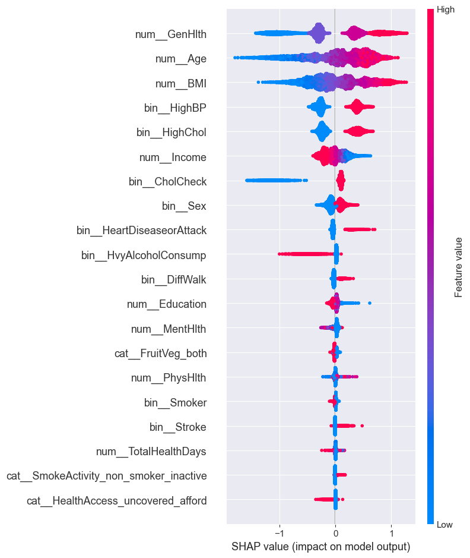
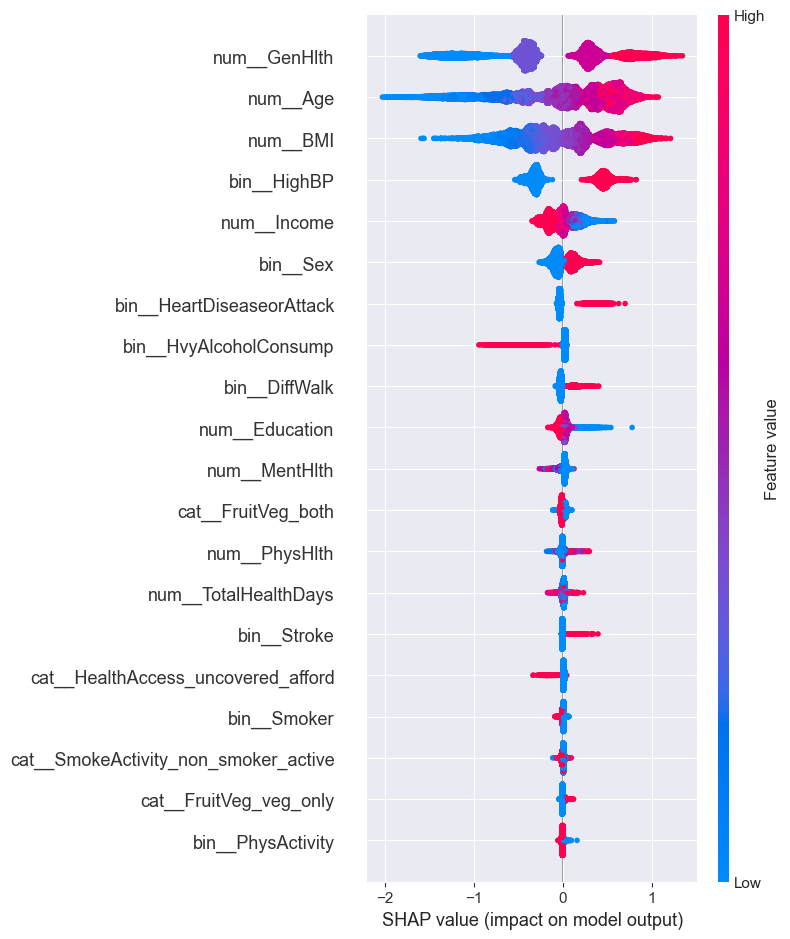

# Diabetes Risk Prediction Model Using Health Indicators (BRFSS 2015)
A machine learning pipeline in a notebook to predict diabetes risk based on behavioral and demographic health indicators from the BRFSS 2015 dataset. Includes exploratory data analysis, feature engineering, and model evaluation using logistic regression and LightGBM.

## Data 
Data is from Kaggle, and is a cleaned version of the CDC Behavioral Risk Factor Surveillance System (BRFSS) 2015. The dataset includes health survey responses related to diabetes, covering indicators like BMI, alcohol use, and general health status.

### Dataset link: 
https://www.kaggle.com/datasets/alexteboul/diabetes-health-indicators-dataset/data?select=diabetes_012_health_indicators_BRFSS2015.csv

## Project Goals
- Predict whether an individual is at high risk of diabetes or prediabetes
- Prioritize high recall during model evaluation to better identify true positive cases
- Use model interpretation (e.g. SHAP) to understand key drivers influencing predictions
- Identify and address potential data leakage (e.g. cholesterol features potentially reflecting post-diagnosis behavior)
- Package and save the final model pipeline 

## Areas for Improvements:
- Increase model precision without losing recall through advanced ensemble methods and/or alternative classifiers
- Explore temporal modeling approaches to separate risk prediction from disease management behavior
- Explore alternative methods to handle class imbalance, such as SMOTE or class weighting

## Model Interpretation with SHAP:

*SHAP values showing feature importance when cholesterol indicators are included.*

*SHAP values after removing cholesterol-related features in case of potential data leakage.*

## Additional Visualizations:
The folder 'demographic_data_viz' contains 5 extra EDA plots that help explain the demographics of the dataset.
